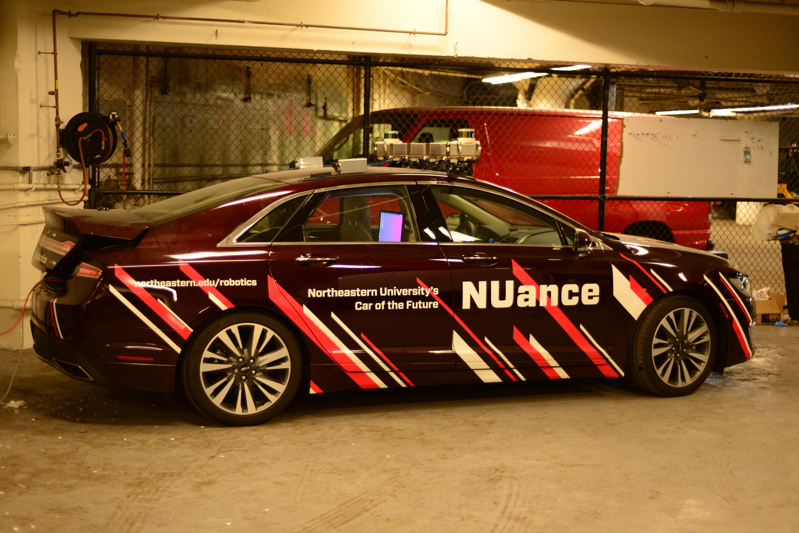

# EECE5698 Final Project Visual Navigation
  
At Northeastern University, I took Robotics Sensing and Navigation which contained a final project at the end. For this final project, I developed a visual navigation system along with teammates. My main contribution to this project was acquiring the data for the experiment, writing the computer vision algorithms for horizon identification and writing the horizon matching algorithm. For the data acquisition this was done in a Lincoln MKZ with a Point Grey camera aimed out the window on Tremont Street. GPS+IMU data used as reference was sampled and broadcasted over ROS and the camera data was acquired with the GPS time base. As for the computer vision algorithms, I used MATLAB for the analysis and was able to profile the code to run in near real-time by determining the optimal camera resolution for localization. Code to run the data is run main mat, which uses data stored in a separate location. 
